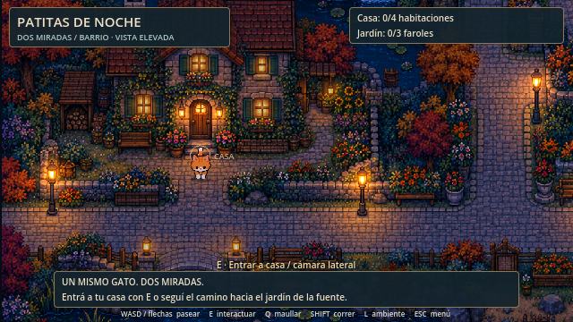

# Botija · Patitas de Noche

Prototipo Godot de un gato que explora un barrio con vista elevada y una casa con cámara lateral. Base modular **0.2.0**, desarrollada con **Godot 4.7.2 / Compatibility**.



## Abrir y jugar

Cloná este repositorio, importá `project.godot` en Godot 4.7.2 y presioná **F5**. La escena principal es `game/game.tscn`. Esperá la importación inicial de las texturas antes de ejecutar.

WASD/flechas: moverse · Shift: correr · E: interactuar · Espacio: saltar dentro de casa · Q: maullar · L: ambiente · M: silencio · Esc: pausa.

El paseo consiste en visitar sala, cocina, dormitorio y baño; encender los tres faroles del jardín; volver a descansar en la cama. La partida se guarda en `user://dos_miradas.json`, compatible con el prototipo anterior.

## Cómo está dividido

| Carpeta | Responsabilidad |
| --- | --- |
| `game/` | Composición, estado de la sesión y coordinación |
| `game/paseo/` | Reglas de la misión y señales de resultados |
| `actors/cat/` | Gato, colisión, movimiento y material del sprite |
| `world/neighborhood/` | Barrio: fondo, zonas transitables e interacciones |
| `world/living_room/`, `kitchen/`, `bedroom/`, `bathroom/` | Una escena editable por habitación |
| `world/lighting/` | Luces cálidas, ambiente y parpadeo |
| `camera/` | Encuadre de ambas perspectivas |
| `ui/` | HUD y menú de pausa, con escenas editables |
| `systems/` | Lectura, validación y escritura de guardados |
| `audio/` | Efectos sintetizados |
| `tests/` | Recorrido de integración y capturas |
| `tools/` | Comandos portables de ejecución y pruebas |
| `docs/` | Arquitectura, colaboración, arte y capturas |

Leé [Arquitectura](docs/ARQUITECTURA.md) y [Cómo colaborar](CONTRIBUTING.md) antes de extender la base.

Para publicar los commits locales de esta entrega, ejecutá `Subir a GitHub.cmd` desde la carpeta del repositorio. El acceso usa tu sesión de GitHub en Windows. Sube únicamente `codex/project-architecture`, sin forzar ni integrar otras ramas.

## Verificación

En PowerShell, desde el repositorio:

```powershell
./tools/check.ps1 -GodotPath 'C:/ruta/Godot_v4.7.2-stable_win64.exe'
```

También podés ejecutar `godot --headless --editor --import --quit` y después `godot --headless --fixed-fps 60 -- --test`. La suite usa un guardado de prueba independiente y sale con código distinto de cero si falla. El resultado esperado está documentado en `docs/VALIDACION.md`.

## Alcance visual

Los fondos siguen siendo ilustraciones planas: los muebles dibujados no son todavía objetos interactivos separados. El gato conserva el material de recorte provisional del prototipo. La reorganización permite reemplazar esas piezas progresivamente; no convierte el arte existente en un tileset. Detalles y procedencia en [Arte y prompts](docs/ARTE_Y_PROMPTS.md).

El historial de diseño existente permanece en la rama `sprint1`. Esta rama contiene el proyecto modular; no modifica `stable`.
